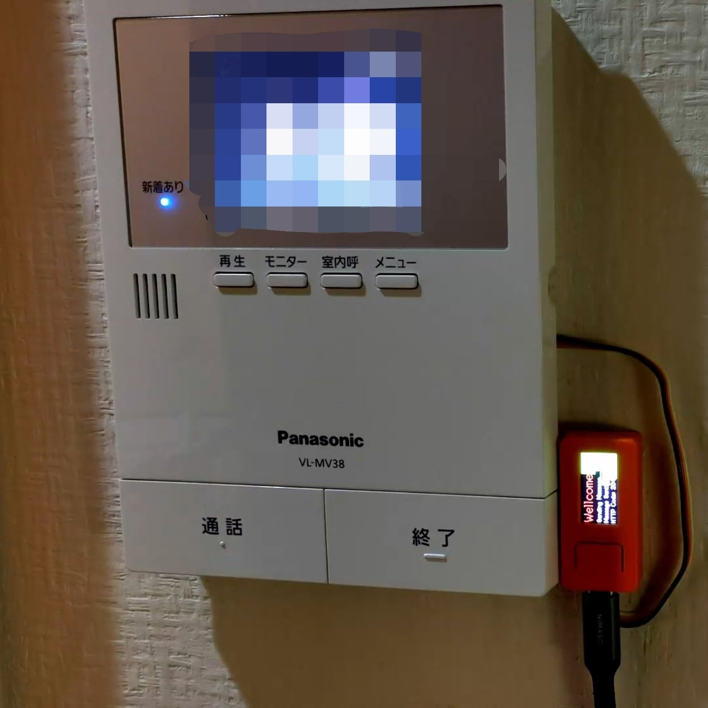
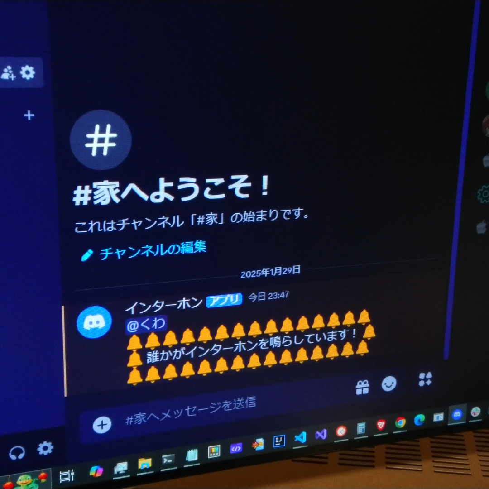
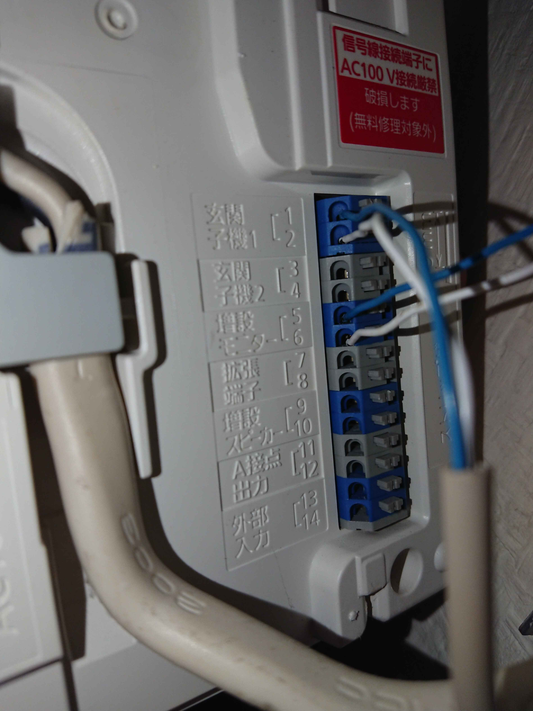

# IntercomNotificator

  
  

M5StickCを使って、インターホンをネット経由で通知するプログラム

スイッチが押されると、Discordに通知が送信され、誰かがインターホンを鳴らしたことを知らせます

> **追記**

Twitterで大好評だったので、使い方を詳しく書きました 
https://x.com/kuwamain/status/1888183724388622832/

## 必要なもの
- **M5StickC or ESP32**: 小型のESP32開発ボード
- **Wi-Fi接続情報**: プログラムをWi-Fiに接続するためのSSIDとパスワード
- **Discord Webhook URL**: 通知を送信するためのDiscord Webhook URL

## 作り方
### 必要なライブラリのインストール
- M5StickCのライブラリ
- ESP32のライブラリ

`WiFi.h`も`HTTPClient.h`も、ESP32のライブラリの中に入っています

Arduino IDE等でインストールしてパスを通しておきましょう

### secret.h
`secret.h.example`をコピーして、`secret.h`を作成してください

中にWI-FI設定とDiscordのWebhookの設定を書き込んでください

### 設置
まずはインターホンの説明書をよく読みましょう

運がよくインターホンが押されたときにONになる A接点出力 なんてものがあれば、そこに設定した入力PINとグランドを接続するだけで使えます

